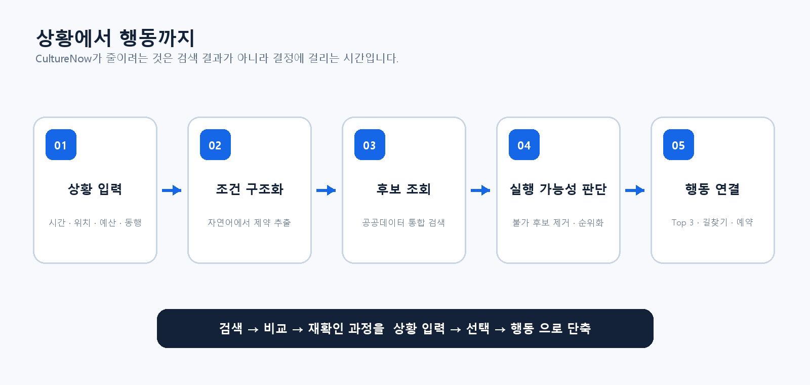
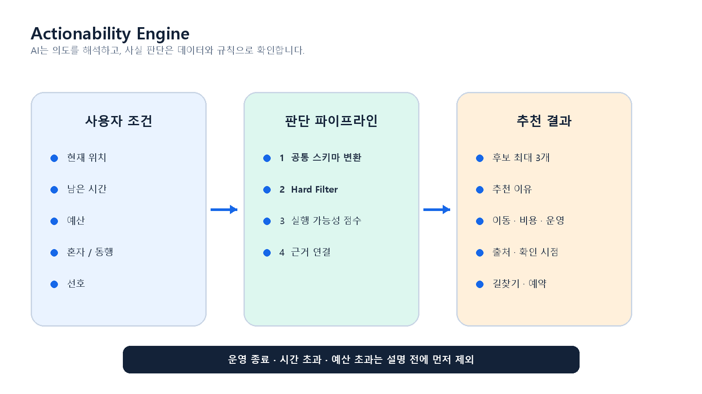
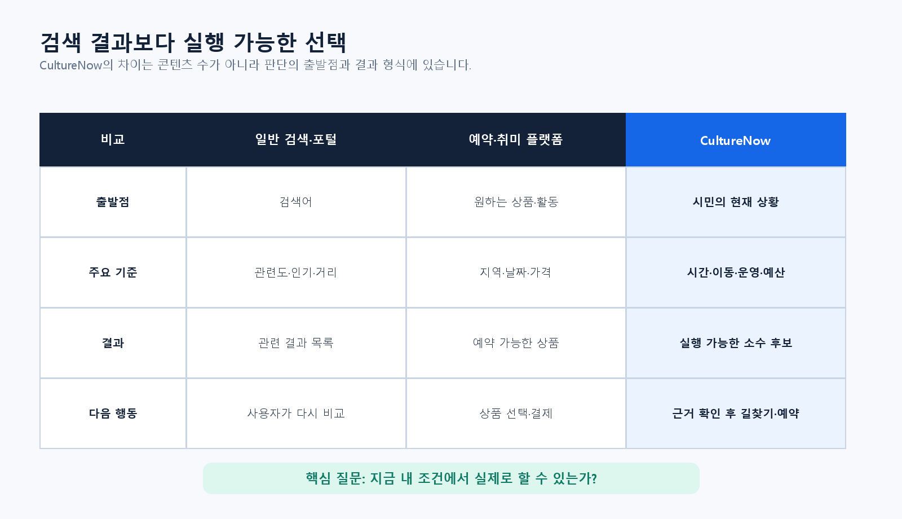

# CultureNow

> 흩어진 공공 문화·체육·관광 정보를 모아, **지금 내 조건에서 실제로 할 수 있는 활동**을 골라주는 GovTech 서비스 기획

CultureNow는 공연이나 시설 목록을 한곳에 모으는 데서 출발하지 않았습니다. 일정 사이에 두 시간이 남았을 때 필요한 것은 더 많은 검색 결과가 아니라, 이동시간과 운영시간을 따져 **지금 갈 수 있는 곳 몇 개**를 알려주는 일이라고 보았습니다.

이 저장소는 2026 GovTech 창업경진대회 아이디어 기획 분야에 제출한 내용을 포트폴리오 형태로 다시 정리한 것입니다. 아직 구현된 제품은 아니며, 문제 정의와 데이터 구조, 판단 로직, 사업화 가설, 검증 계획을 담고 있습니다.

## 문제를 이렇게 정의했습니다

공공 문화·체육·관광 정보는 이미 여러 기관에서 제공하고 있습니다. 다만 시민이 실제로 이용하려면 문화포털, 공연·관광 정보, 체육시설, 지도, 날씨, 예약 페이지를 오가며 다음 내용을 직접 확인해야 합니다.

- 오늘 운영하는가
- 남은 시간 안에 이동하고 이용할 수 있는가
- 예산 안에 들어오는가
- 예약이 필요한가
- 혼자 참여할 수 있는가

CultureNow가 줄이려는 것은 정보의 양이 아니라 **검색과 비교에 드는 의사결정 비용**입니다.

## 제안하는 방식

사용자는 필터를 하나씩 고르는 대신 평소 말하듯 상황을 입력합니다.

> 오늘 저녁 부산에서 두 시간 정도 시간이 남았어. 혼자 갈 수 있고 2만 원 이하면 좋겠어.

서비스는 문장에서 시간, 위치, 예산, 동행 여부와 선호를 구조화합니다. 이후 공공데이터에서 후보를 찾고, 조건에 맞지 않는 활동을 제외한 뒤 실행 가능성이 높은 순서로 세 가지 안팎의 선택지를 제시합니다. 추천 이유와 함께 이동시간, 비용, 운영 여부, 예약 링크도 보여줍니다.

## Actionability Engine

핵심은 취향을 맞히는 추천 모델보다 **실행 불가능한 후보를 먼저 걷어내는 판단 구조**입니다.

1. 자연어에서 사용자 조건을 추출합니다.
2. 공공 API와 외부 API에서 사실 정보를 조회합니다.
3. 운영 종료, 시간 초과, 예산 초과처럼 명확히 맞지 않는 후보를 제거합니다.
4. 이동 부담, 선호도, 날씨, 예약 편의 등을 점수화합니다.
5. 근거와 출처를 붙여 소수의 후보만 설명합니다.

LLM은 의도를 해석하고 결과를 설명하는 데 사용합니다. 시설의 존재, 운영시간, 가격처럼 틀리면 바로 불편으로 이어지는 정보는 데이터에서 확인합니다. 데이터가 오래되었거나 비어 있다면 임의로 채우지 않고 기준 시점과 확인 필요 상태를 표시하는 것이 원칙입니다.

자세한 판단 단계와 예외 처리는 [서비스 아키텍처](docs/ARCHITECTURE.md)에 정리했습니다.

## 데이터 구성

| 영역 | 검토 데이터 | 쓰임 |
|---|---|---|
| 문화 | 문화포털 및 문화 공공데이터 | 전시·행사·체험·시설 후보 |
| 공연 | KOPIS Open API | 공연 목록과 상세 정보 |
| 관광 | TourAPI | 관광지·축제·지역 행사 |
| 체육 | 전국체육시설 관련 Open API | 생활체육시설 위치와 유형 |
| 공공자원 | 공유누리 Open API | 공간·강좌·체육시설 등 개방 자원 |
| 환경 | 기상 데이터, 지도·교통 API | 야외 적합성, 거리와 이동시간 |

서로 다른 응답은 `activity_id`, `name`, `location`, `operating_hours`, `price`, `reservation_required`, `source`, `updated_at` 등의 공통 필드로 정규화합니다. 원천별 갱신주기가 다르므로 출처와 확인 시각을 결과에 함께 노출합니다.

## 기존 서비스와 다른 지점

CultureNow의 차이는 콘텐츠를 더 많이 보유하는 데 있지 않습니다.

- 검색어가 아니라 **사용자의 현재 상황**에서 시작합니다.
- 문화, 체육, 관광을 구분해서 찾지 않고 한 번에 비교합니다.
- 인기나 취향뿐 아니라 시간·이동·운영·비용처럼 행동을 막는 조건을 먼저 봅니다.
- 결과를 나열하지 않고, 왜 지금 가능한지 설명한 뒤 길찾기와 예약으로 연결합니다.

## 예비 검증

일반인 27명을 대상으로 문제 경험과 초기 이용 의향을 확인했습니다. 표본이 작아 시장 전체를 대표하는 통계로 사용하지 않고, 무엇을 먼저 검증할지 정하는 탐색 자료로만 해석했습니다.

| 질문 | 결과 |
|---|---:|
| 정보를 한 번에 확인하기 어렵거나 추가 확인을 해본 경험 | 20명 / 27명 (74.1%) |
| 상황 기반 추천 서비스 이용 의향 긍정 | 20명 / 27명 (74.1%) |
| 많은 목록보다 소수 후보로 압축한 방식 선호 | 19명 / 27명 (70.4%) |
| 지도·길찾기·예약 연결이 필요하거나 유용 | 22명 / 27명 (81.5%) |

추천 조건으로는 위치·이동시간(77.8%)과 이용 가능 시간·운영시간(70.4%)이 가장 많이 선택되었습니다. 취향 추천보다 먼저 시간과 이동 가능성을 검증해야 한다는 판단의 근거가 되었습니다. 설문 해석과 다음 검증 계획은 [검증 계획](docs/VALIDATION.md)에서 확인할 수 있습니다.

## 사업화 가설

시민용 탐색과 추천은 무료 제공을 기본 방향으로 두었습니다. 수익모델은 공공서비스 접근성을 해치지 않는 범위에서 검토했습니다.

- **B2G**: 지자체·공공기관용 통합 추천, 저이용 자원 분석, 지역 수요 대시보드
- **B2B**: 예약·체험 서비스 연결, 추천 API, 이용 전환 기반 제휴
- **B2C**: 기본 추천은 무료로 제공하고, 초기 핵심 수익원으로 전제하지 않음

사업모델의 전제와 확인해야 할 위험은 [사업·KPI 문서](docs/BUSINESS_AND_KPI.md)에 구분해 두었습니다.

## 다음 단계

첫 MVP는 전국 서비스를 목표로 하지 않습니다. 한 지역에서 2~3개 데이터 소스만 연결해 다음 질문부터 확인하려 합니다.

1. 서로 다른 데이터에서 운영시간·가격·예약정보를 안정적으로 맞출 수 있는가
2. 규칙 기반 필터만으로 명백히 불가능한 후보를 얼마나 제거할 수 있는가
3. 사용자가 추천 이유를 이해하고 실제 길찾기나 예약으로 이동하는가
4. 기존 검색보다 활동 결정까지 걸리는 시간이 줄어드는가

구현 순서와 단계별 완료 기준은 [로드맵](docs/ROADMAP.md)에 정리했습니다.

## 문서 안내

| 문서 | 내용 |
|---|---|
| [문제와 해결 방향](docs/PROBLEM_AND_SOLUTION.md) | 문제를 좁혀 온 과정, 사용자 흐름, 기능 범위 |
| [서비스 아키텍처](docs/ARCHITECTURE.md) | 데이터 정규화, 판단 파이프라인, 실패 처리 |
| [사업·KPI](docs/BUSINESS_AND_KPI.md) | 이해관계자별 가치, 사업 가설, 성과지표 |
| [검증 계획](docs/VALIDATION.md) | 27명 예비조사, 한계, 후속 실험 |
| [개발 로드맵](docs/ROADMAP.md) | 지역 단위 MVP부터 실증까지의 순서 |
| [비식별 원본 기획서](original/CultureNow_idea_plan_redacted.pdf) | 제출 기획서 본문, 문서 메타데이터 제거본 |

## 현재 상태

`기획 완료 · MVP 미구현 · 예비 수요조사 완료`

이 저장소는 완성 제품의 성능을 주장하지 않습니다. 실제 API의 품질과 갱신주기, 실행 가능성 점수의 정확도, 지역별 데이터 편차, 동행 기능의 안전성과 운영비용은 앞으로 검증해야 할 항목입니다.

---

**한 문장으로 정리하면:** CultureNow는 공공정보를 더 많이 보여주는 서비스가 아니라, 사용자의 시간과 위치 안에서 **오늘 실제로 할 수 있는 선택**으로 바꾸는 서비스입니다.
