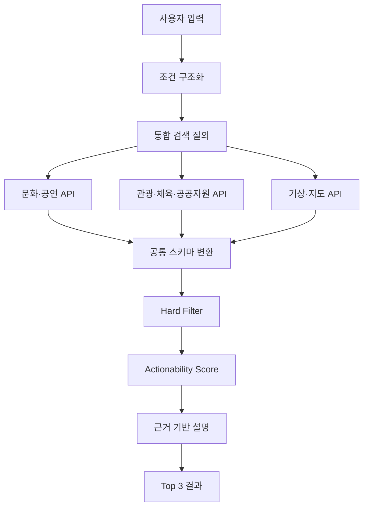

# 서비스 아키텍처

## 설계 목표

CultureNow의 기술 구조는 AI가 모든 답을 생성하는 형태가 아닙니다. 자연어 이해, 사실 조회, 규칙 판정, 설명 생성을 분리해 오류가 생긴 지점을 확인할 수 있도록 설계했습니다.



## 1. 사용자 조건 구조화

자연어 입력을 검색과 판정에 사용할 수 있는 형태로 바꿉니다.

```json
{
  "location": "부산",
  "available_from": "2026-09-30T18:00:00+09:00",
  "available_minutes": 120,
  "budget_max": 20000,
  "party": "solo",
  "preferences": ["indoor_or_weather_safe"]
}
```

값을 확정할 수 없으면 추측 대신 `null`과 신뢰도를 저장하고, 추천 결과를 크게 바꾸는 조건만 사용자에게 다시 묻습니다.

## 2. 공통 활동 스키마

기관별 응답 형식이 달라도 판정 단계에서는 같은 필드를 사용합니다.

| 필드 | 설명 |
|---|---|
| `activity_id` | 원천과 원본 식별자를 조합한 내부 키 |
| `name`, `category` | 활동명과 표준 분류 |
| `location` | 주소와 좌표 |
| `operating_period` | 행사·프로그램 운영 기간 |
| `operating_hours` | 요일별 이용 가능 시간 |
| `price` | 무료 여부, 최소·최대 비용 |
| `reservation_required` | 예약 필수·선택·확인 필요 |
| `indoor_outdoor` | 실내·야외·혼합 |
| `information_url` | 원 안내 페이지 |
| `reservation_url` | 원 예약 페이지 |
| `source`, `updated_at` | 출처와 데이터 기준 시각 |

원천 필드가 비어 있는 경우 `0`, `무료`, `예약 불필요`로 바꾸지 않습니다. `unknown` 상태를 유지해야 필터가 잘못된 확신으로 후보를 통과시키지 않습니다.

## 3. Hard Filter

명확한 제약은 점수 경쟁 전에 처리합니다.

- 운영 기간이 지남
- 도착 전에 운영이 끝남
- 이동과 최소 체류시간을 합치면 가용 시간을 초과함
- 최소 비용이 예산을 초과함
- 휴관 또는 매진이 확인됨
- 필수 예약의 마감이 지남

정보가 없다는 이유만으로 무조건 탈락시키지는 않습니다. 대신 결과에 `확인 필요`를 붙이고, 신뢰도 점수에서 감점합니다.

## 4. 실행 가능성 점수

초기 점수는 학습 모델보다 설명 가능한 가중 합으로 시작합니다.

```text
score = 시간 적합도
      + 이동 부담
      + 예산 적합도
      + 운영정보 신뢰도
      + 날씨 적합도
      + 사용자 선호
      + 예약 편의성
```

가중치는 고정된 정답이 아니라 실증으로 조정할 값입니다. 최초 MVP에서는 사용자의 선택 여부와 실제 이용 연결을 기록해, 어떤 조건이 결과 선택에 영향을 주었는지 확인합니다.

## 5. 결과 설명

설명은 판정 결과에 이미 존재하는 근거만 사용합니다.

```text
현재 위치에서 약 18분 거리이고, 20시까지 운영합니다.
무료이며 별도 예약이 필요하지 않아 남은 두 시간 안에 이용할 수 있습니다.
운영정보 기준: 2026-09-30 17:30 / 출처: 원 제공기관
```

추천 문장과 사실 데이터 사이에 근거 연결을 두면, 잘못된 문구가 나왔을 때 원천 데이터·규칙·설명 중 어디서 문제가 생겼는지 추적할 수 있습니다.

## 실패와 예외 처리

| 상황 | 처리 원칙 |
|---|---|
| API 응답 지연·실패 | 해당 원천을 표시하고 나머지 결과만 제공 |
| 갱신 시점이 오래됨 | 기준 시점을 노출하고 이용 전 재확인 안내 |
| 운영시간 형식 불일치 | 자동 확정하지 않고 확인 필요 상태로 분리 |
| 이동시간 조회 실패 | 직선거리로 대체했다고 명시하거나 순위 산정에서 제외 |
| 추천 후보가 없음 | 조건을 임의로 완화하지 않고 변경 가능한 조건을 제안 |
| 결과 간 점수 차가 작음 | 순위를 과장하지 않고 동률에 가까움을 표시 |

## 개인정보와 운영 고려

초기 추천 기능은 상세 위치 이력을 장기 보관하지 않아도 동작하도록 설계합니다. 동행 기능을 추가할 경우에는 연락처 직접 노출을 피하고, 본인인증·신고·차단·노쇼 이력·공개 장소 안내를 별도 운영 체계로 다뤄야 합니다.
