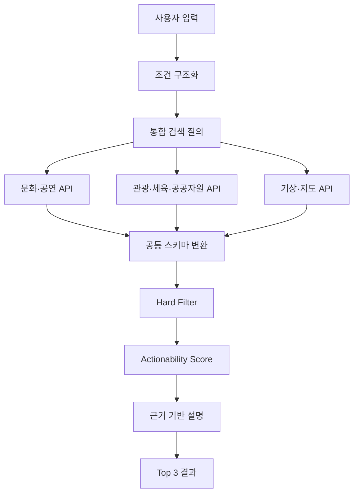

# 서비스 아키텍처

## 설계 목표

처음에는 LLM이 추천 과정 대부분을 맡는 방식도 생각했습니다. 하지만 운영시간이나 가격처럼 틀리면 바로 사용자 불편으로 이어지는 정보까지 생성형 AI에 맡기는 것은 위험하다고 봤습니다. 그래서 자연어 해석, 사실 조회, 규칙 판정, 결과 설명을 나눠 설계했습니다. 이렇게 나눠야 잘못된 결과가 나왔을 때 어느 단계에서 문제가 생겼는지도 확인할 수 있습니다.



## 1. 사용자 조건 구조화

사용자가 입력한 문장을 그대로 검색에 넣기보다, 검색과 판정에 필요한 조건으로 먼저 풀어냅니다.

```json
{
  "location": "부산",
  "available_from": "2026-09-30T18:00:00+09:00",
  "available_minutes": 120,
  "budget_max": 20000,
  "party": "solo",
  "preferences": ["indoor_or_weather_safe"]
}
```

문장에서 값을 확정하기 어렵다고 해서 임의로 채우지는 않습니다. `null`과 신뢰도를 남기고, 답에 큰 영향을 주는 조건만 사용자에게 다시 묻습니다. 질문을 너무 많이 하면 검색보다 더 번거로운 서비스가 되기 때문입니다.

## 2. 공통 활동 스키마

기관별 API는 이름도 형식도 서로 다릅니다. 판정 단계에서 매번 원천별 예외를 다루지 않도록 아래 공통 필드에 맞춥니다.

| 필드 | 설명 |
|---|---|
| `activity_id` | 원천과 원본 식별자를 조합한 내부 키 |
| `name`, `category` | 활동명과 표준 분류 |
| `location` | 주소와 좌표 |
| `operating_period` | 행사·프로그램 운영 기간 |
| `operating_hours` | 요일별 이용 가능 시간 |
| `price` | 무료 여부, 최소·최대 비용 |
| `reservation_required` | 예약 필수·선택·확인 필요 |
| `indoor_outdoor` | 실내·야외·혼합 |
| `information_url` | 원 안내 페이지 |
| `reservation_url` | 원 예약 페이지 |
| `source`, `updated_at` | 출처와 데이터 기준 시각 |

원천 필드가 비어 있다고 해서 `0`, `무료`, `예약 불필요`로 바꾸지는 않습니다. 빈 값을 편의상 확정값으로 바꾸면 실제로는 예약이 필요한 활동을 그대로 추천할 수 있습니다. 그래서 `unknown` 상태를 유지하고, 모르는 정보가 있다는 사실도 판단에 반영합니다.

## 3. Hard Filter

점수를 아무리 정교하게 계산해도 이미 문을 닫았거나 예산을 넘긴 후보는 추천할 이유가 없습니다. 이런 명확한 제약은 순위를 매기기 전에 처리합니다.

- 운영 기간이 지남
- 도착 전에 운영이 끝남
- 이동과 최소 체류시간을 합치면 가용 시간을 초과함
- 최소 비용이 예산을 초과함
- 휴관 또는 매진이 확인됨
- 필수 예약의 마감이 지남

정보가 없다는 이유만으로 무조건 탈락시키지는 않습니다. 데이터가 덜 채워졌다는 이유만으로 이용 가능한 후보까지 사라질 수 있기 때문입니다. 대신 결과에 `확인 필요`를 붙이고 신뢰도 점수에서 감점합니다.

## 4. 실행 가능성 점수

첫 버전부터 학습 모델을 쓰면 점수가 왜 그렇게 나왔는지 설명하기 어렵습니다. 초기 점수는 조건별 영향을 확인할 수 있는 가중 합으로 시작합니다.

```text
score = 시간 적합도
      + 이동 부담
      + 예산 적합도
      + 운영정보 신뢰도
      + 날씨 적합도
      + 사용자 선호
      + 예약 편의성
```

가중치는 처음부터 정답을 정할 수 있는 값이 아닙니다. 최초 MVP에서는 사용자의 선택 여부와 실제 이용 연결을 기록하고, 어떤 조건이 결과 선택에 영향을 주었는지 본 뒤 조정합니다.

## 5. 결과 설명

결과 설명에 새로운 사실을 덧붙이지 않습니다. 판정에 사용한 근거만 문장으로 바꿉니다.

```text
현재 위치에서 약 18분 거리이고, 20시까지 운영합니다.
무료이며 별도 예약이 필요하지 않아 남은 두 시간 안에 이용할 수 있습니다.
운영정보 기준: 2026-09-30 17:30 / 출처: 원 제공기관
```

추천 문장에는 사용한 사실 데이터를 연결해 둡니다. 그래야 잘못된 안내가 나왔을 때 원천 데이터가 틀렸는지, 규칙이 잘못됐는지, 설명 과정에서 달라졌는지 찾아볼 수 있습니다.

## 실패와 예외 처리

| 상황 | 처리 원칙 |
|---|---|
| API 응답 지연·실패 | 해당 원천을 표시하고 나머지 결과만 제공 |
| 갱신 시점이 오래됨 | 기준 시점을 노출하고 이용 전 재확인 안내 |
| 운영시간 형식 불일치 | 자동 확정하지 않고 확인 필요 상태로 분리 |
| 이동시간 조회 실패 | 직선거리로 대체했다고 명시하거나 순위 산정에서 제외 |
| 추천 후보가 없음 | 조건을 임의로 완화하지 않고 변경 가능한 조건을 제안 |
| 결과 간 점수 차가 작음 | 순위를 과장하지 않고 동률에 가까움을 표시 |

## 개인정보와 운영 고려

초기 추천 기능에는 상세 위치 이력을 장기 보관하지 않아도 되는 방식을 우선 적용합니다. 동행 기능은 추천 기능과 운영 성격이 다릅니다. 나중에 추가하더라도 연락처 직접 노출을 피하고, 본인인증·신고·차단·노쇼 이력·공개 장소 안내를 별도 운영 체계로 다뤄야 합니다.
