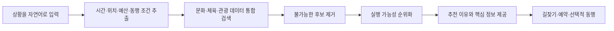

# 문제와 해결 방향

## 출발점

CultureNow는 “문화 정보를 한곳에 모으면 편리하겠다”는 생각보다, 갑자기 생긴 여가시간에 무엇을 할지 정하기 어려웠던 경험에서 시작했습니다. 공연, 전시, 운동, 지역 행사는 이미 많았습니다. 그런데 지금 출발해도 되는지, 문을 닫기 전까지 이용할 수 있는지 확인하려면 검색을 몇 번씩 반복해야 했습니다.

처음에는 정보가 부족해서 생기는 문제라고 생각했습니다. 기존 서비스를 살펴보니 정보 자체는 이미 여러 곳에 있었습니다. 부족했던 것은 정보보다, 흩어진 내용을 현재 상황에 맞춰 판단해 주는 과정이었습니다. 그래서 두 문제를 나눠 보았습니다.

- 정보의 부재: 이용할 수 있는 시설이나 프로그램 자체가 없음
- 정보 이용의 불편: 정보는 있지만 여러 곳에 흩어져 있고 행동 조건을 직접 대조해야 함

둘 중 CultureNow가 먼저 다루기로 한 것은 두 번째 문제입니다. 새로운 행사나 시설을 만드는 일보다, 이미 있는 자원을 실제 선택으로 이어주는 일이 이 기획에서 풀 수 있는 문제라고 판단했습니다.

## 핵심 사용자 상황

활동명을 이미 정했다면 기존 검색과 예약 서비스도 충분히 쓸 수 있습니다. CultureNow가 필요한 순간은 하고 싶은 일을 아직 정하지 못했고, 시간이나 예산 같은 조건만 분명할 때라고 봤습니다.

- 외부 일정 뒤 두 시간이 남은 직장인
- 주말에 아이와 가까운 곳을 찾는 보호자
- 비용 부담 없이 혼자 참여할 활동을 찾는 시민
- 비가 오는 날 실내 프로그램을 찾는 여행자

이때 사용자의 질문은 “부산의 문화시설 목록”이 아니라 “지금부터 두 시간 안에 갈 수 있고, 혼자 참여할 수 있으며, 2만 원 이하인 활동”에 가깝습니다.

## 해결 흐름



후보 이름만 보여주면 사용자는 다시 검색을 시작해야 합니다. 결과 화면에는 활동명과 함께 판단에 필요한 정보를 남깁니다.

- 지금 추천한 이유
- 현재 위치에서의 예상 이동시간
- 이용 가능 시간과 예상 체류시간
- 비용과 예약 필요 여부
- 데이터 출처와 확인 시점

## 기능 범위

### MVP에 포함

- 자연어 조건 입력
- 활동 후보 통합 검색
- 운영·시간·예산·이동 기준 필터
- 소수 후보와 추천 이유 제공
- 지도·길찾기 및 원 예약 페이지 연결

### 실증 이후 검토

- 이용 이력 기반 개인화
- 공공기관용 수요 분석 화면
- 활동별 동행 모집과 서비스 내 채팅
- 본인인증, 신고, 노쇼 이력 등을 반영한 신뢰 관리

동행 기능은 핵심 추천 경험이 검증된 뒤 다룹니다. 오프라인 만남의 안전과 운영비용이 수반되므로, 초기 MVP의 완성도를 떨어뜨리면서까지 함께 구현할 기능은 아니라고 판단했습니다.

## 기획 원칙

1. **결과 수보다 결정 시간을 줄인다.** 많은 목록보다 근거가 분명한 소수 후보를 제공한다.
2. **사실과 해석을 분리한다.** 운영시간과 가격은 데이터에서, 의도 해석과 설명은 AI에서 담당한다.
3. **모르면 모른다고 표시한다.** 오래되거나 누락된 정보를 그럴듯한 문장으로 보완하지 않는다.
4. **외부 인프라를 활용한다.** 길찾기와 예약은 기존 서비스로 연결해 초기 범위를 통제한다.
5. **한 지역에서 먼저 검증한다.** 전국 단위 데이터 수집보다 작은 범위의 정확한 경험을 우선한다.

## 기대 변화

```text
기존: 검색 → 사이트 이동 → 비교 → 조건 확인 → 판단 → 행동
제안: 상황 입력 → 근거가 있는 후보 선택 → 행동
```

이 기획에서 새 공공서비스를 직접 만들지는 않습니다. 이미 운영 중인 자원이 필요한 시민에게 제때 발견되도록 연결하는 데 집중했습니다.
