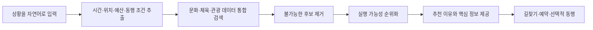

# 문제와 해결 방향

## 출발점

CultureNow는 “문화 정보를 한곳에 모으면 편리하겠다”는 생각보다, 갑자기 생긴 여가시간에 무엇을 할지 정하기 어려웠던 경험에서 시작했습니다. 공연, 전시, 운동, 지역 행사는 이미 많이 존재했지만 짧은 시간 안에 갈 수 있는지 확인하려면 검색을 반복해야 했습니다.

문제를 검토하면서 정보의 부재와 정보 이용의 불편을 구분했습니다.

- 정보의 부재: 이용할 수 있는 시설이나 프로그램 자체가 없음
- 정보 이용의 불편: 정보는 있지만 여러 곳에 흩어져 있고 행동 조건을 직접 대조해야 함

CultureNow가 우선 다루는 것은 두 번째 문제입니다.

## 핵심 사용자 상황

서비스가 유용한 순간은 사용자가 활동명을 이미 정한 때보다, 조건만 있고 선택은 정하지 못한 때입니다.

- 외부 일정 뒤 두 시간이 남은 직장인
- 주말에 아이와 가까운 곳을 찾는 보호자
- 비용 부담 없이 혼자 참여할 활동을 찾는 시민
- 비가 오는 날 실내 프로그램을 찾는 여행자

이때 사용자의 질문은 “부산의 문화시설 목록”이 아니라 “지금부터 두 시간 안에 갈 수 있고, 혼자 참여할 수 있으며, 2만 원 이하인 활동”에 가깝습니다.

## 해결 흐름



결과 화면에서 중요한 것은 활동명보다 판단에 필요한 정보입니다.

- 지금 추천한 이유
- 현재 위치에서의 예상 이동시간
- 이용 가능 시간과 예상 체류시간
- 비용과 예약 필요 여부
- 데이터 출처와 확인 시점

## 기능 범위

### MVP에 포함

- 자연어 조건 입력
- 활동 후보 통합 검색
- 운영·시간·예산·이동 기준 필터
- 소수 후보와 추천 이유 제공
- 지도·길찾기 및 원 예약 페이지 연결

### 실증 이후 검토

- 이용 이력 기반 개인화
- 공공기관용 수요 분석 화면
- 활동별 동행 모집과 서비스 내 채팅
- 본인인증, 신고, 노쇼 이력 등을 반영한 신뢰 관리

동행 기능은 핵심 추천 경험이 검증된 뒤 다룹니다. 오프라인 만남의 안전과 운영비용이 수반되므로, 초기 MVP의 완성도를 떨어뜨리면서까지 함께 구현할 기능은 아니라고 판단했습니다.

## 기획 원칙

1. **결과 수보다 결정 시간을 줄인다.** 많은 목록보다 근거가 분명한 소수 후보를 제공한다.
2. **사실과 해석을 분리한다.** 운영시간과 가격은 데이터에서, 의도 해석과 설명은 AI에서 담당한다.
3. **모르면 모른다고 표시한다.** 오래되거나 누락된 정보를 그럴듯한 문장으로 보완하지 않는다.
4. **외부 인프라를 활용한다.** 길찾기와 예약은 기존 서비스로 연결해 초기 범위를 통제한다.
5. **한 지역에서 먼저 검증한다.** 전국 단위 데이터 수집보다 작은 범위의 정확한 경험을 우선한다.

## 기대 변화

```text
기존: 검색 → 사이트 이동 → 비교 → 조건 확인 → 판단 → 행동
제안: 상황 입력 → 근거가 있는 후보 선택 → 행동
```

목표는 공공서비스를 새로 만드는 것이 아니라, 이미 운영 중인 자원이 적절한 시민에게 적절한 순간에 발견되도록 연결하는 것입니다.
